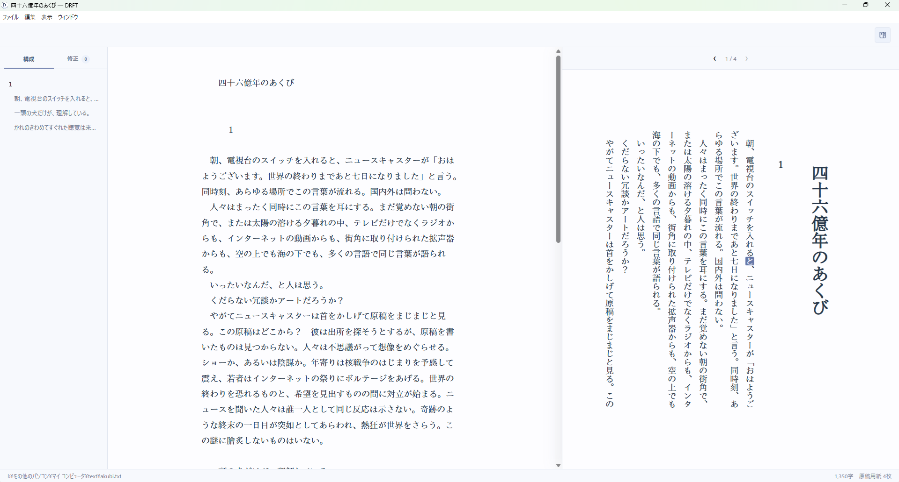
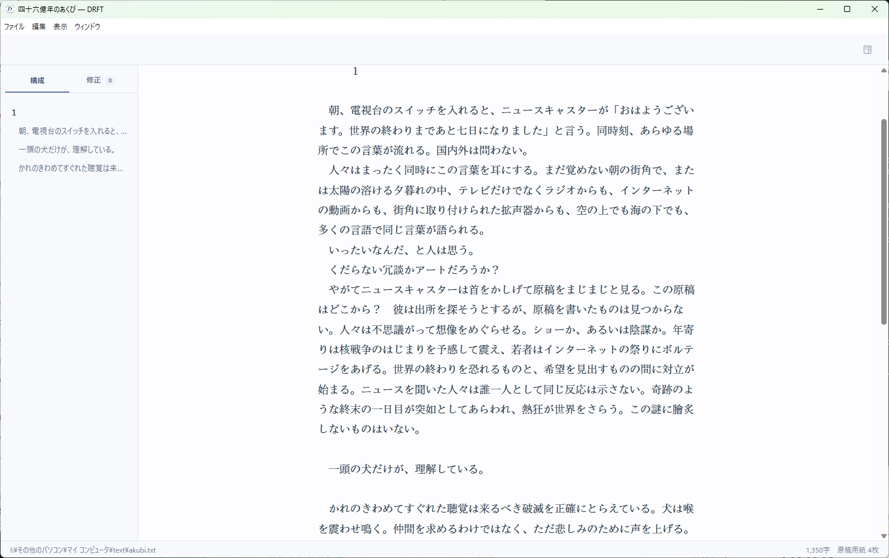
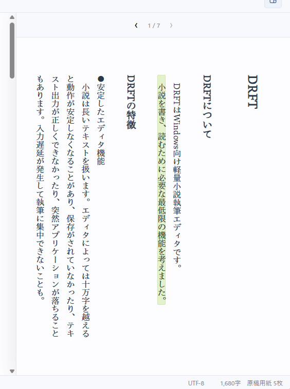
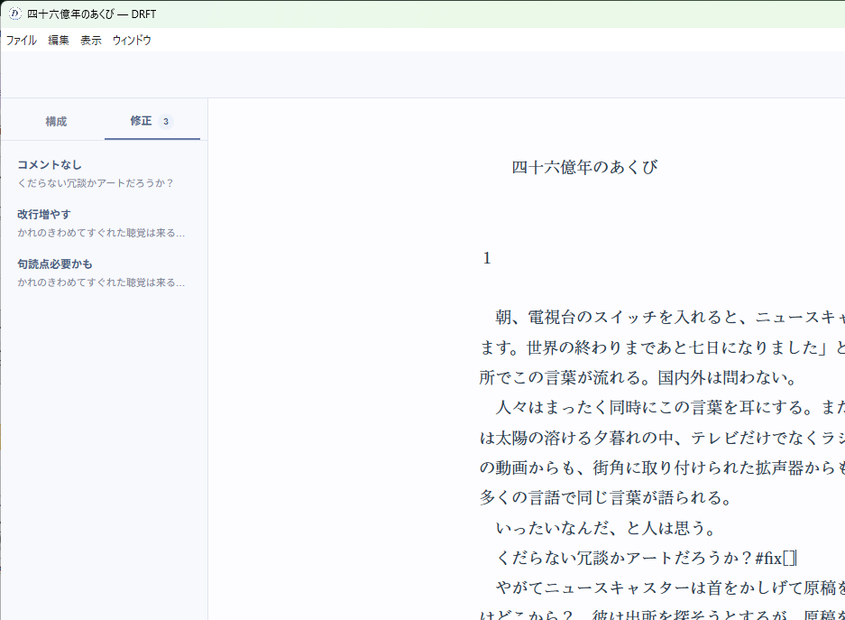

# DRFT

**DRFT** は、書くことへの集中と縦書きでの読み心地を両立する、Windows向けの小説執筆用エディタです。

執筆は入力しやすい横書きで。必要なときだけ縦書きプレビューを開き、読者に近い状態で文章を確認できます。ほかの執筆ツールと併用しやすいよう、ファイルは単独のテキストファイルとして管理されます。


 

## 特徴

- **必要なときだけ開く縦書きプレビュー**  

執筆中はプレビューを閉じて集中できます。


読みやすいプレビュー画面。好きなフォントに変更できます。


- **章と節を見渡せる構成ビュー**  
  原稿内の空行から章と節を自動で判別し、一覧を作成します。一覧から本文へジャンプすることもできます。節はドラッグ＆ドロップで並べ替えられます。
  
- **青空文庫記法・カクヨム記法に対応**  
- **`#fix` マークで修正箇所をメモ**  
  本文中の修正メモを一覧化し、クリックで該当位置へ移動できます。マークが0件になれば完成稿です。
  
- **作品専用の辞書**  
  人名、地名、設定などを見出しと説明で記録します。見出しをクリックすると、本文中の出現箇所を検索できます。
- **執筆量を常時表示**  
  本文文字数と400字詰め原稿用紙換算を表示します。
- **右綴じ見開きPDF**  
  本文先頭を最初の見開きの左側から開始し、右綴じの見開きへ面付けしてPDF出力します。

## インストール方法
[https://github.com/swonoda/drft/releases/tag/0.1.0](https://github.com/swonoda/drft/releases/tag/0.1.0)からDRFT_v0.1.0.zipをダウンロードし、解凍し、DRFT Setup 0.1.0.exeを実行してください。
インストールせずに使用する場合はDRFT 0.1.0.exeを実行してください


## 原稿の構造

DRFTは空行から原稿の構造を読み取ります。

| 書き方           | DRFTでの扱い |
| ---------------- | ------------ |
| 先頭の1行        | タイトル     |
| 1行空き          | 節の区切り   |
| 2行空きの次の行  | 章見出し     |

文字数は、改行とルビ・傍点・修正マークの記法を除き、本文として表示される文字を数えます。全角空白と句読点はそれぞれ1字として扱い、400字で割った余りを切り上げて原稿用紙枚数へ換算します。

## 対応記法

### ルビ

青空文庫記法とカクヨム記法を利用できます。

```text
｜流氷《りゅうひょう》
|流氷《りゅうひょう》
流氷《りゅうひょう》
```

### 傍点

傍点は縦書き向けのゴマで表示されます。

```text
重要［＃「重要」に傍点］
《《重要》》
```

現在対応している青空文庫記法・カクヨム記法は、ルビと傍点です。

### 修正マーク

本文中へ `#fix[コメント]` を置くと、左側の「修正」ビューへ一覧表示されます。

```text
白熊は水平線を見つめていた。#fix[季節が分かる描写を追加]
```

修正マークはTXTにはそのまま保存されますが、文字数、縦書きプレビュー、PDFには表示されません。

## 作品フォルダと辞書

「作品フォルダを開く」では、フォルダ内のTXTを主原稿として選択します。辞書は同じフォルダの `辞書.md` に保存されます。DRFTが管理しないファイルやサブフォルダは変更しません。

```text
作品名/
├── 作品名.txt
├── 辞書.md
├── その他のファイル
└── 資料/
```

辞書はMarkdownの見出しと説明で構成されます。

```markdown
# 主人公

物語の中心人物。好物は温かいスープ。

# 北港

物語の舞台となる架空の港町。読みはノースポート。
```

辞書の見出しをクリックすると、主原稿内の同じ語へジャンプします。繰り返しクリックすると次の出現箇所へ進みます。変更後は保存ボタンまたは `Cmd/Ctrl+S` で保存できます。

## PDF出力

PDFはA5単ページを生成したあと、右綴じの見開きへ面付けします。本文先頭は論理2ページ目、つまり最初の見開きの左側へ配置され、右側は空白になります。

```text
見開き1  [ 2ページ ] [ 空白 ]
見開き2  [ 4ページ ] [ 3ページ ]
見開き3  [ 6ページ ] [ 5ページ ]
```

トンボ・裁ち落とし指定にはChromiumの印刷エンジンを利用しています。商業印刷向けの完全な出力は保証していません。

## ショートカット

| 操作               | macOS | Windows        |
| ------------------ | ----- | -------------- |
| 新規作成           | `⌘N`  | `Ctrl+N`       |
| 開く               | `⌘O`  | `Ctrl+O`       |
| 作品フォルダを開く | `⇧⌘O` | `Ctrl+Shift+O` |
| 保存               | `⌘S`  | `Ctrl+S`       |
| 名前をつけて保存   | `⇧⌘S` | `Ctrl+Shift+S` |
| 検索               | `⌘F`  | `Ctrl+F`       |
| 置換               | `⌥⌘F` | `Ctrl+H`       |
| 構成の表示・非表示 | `⌥⌘O` | `Ctrl+Alt+O`   |
| 縦書きプレビュー   | `⇧⌘V` | `Ctrl+Shift+V` |
| 辞書               | `⇧⌘D` | `Ctrl+Shift+D` |
| PDF出力            | `⇧⌘P` | `Ctrl+Shift+P` |

## 開発

### 必要環境

- Node.js 22.12以降
- npm

### ソースから起動

```bash
npm install
npm start
```

### Windows版を作成

インストーラー版とポータブル版を `dist` フォルダへ出力します。

```bash
npm run dist:win
```

### テスト

```bash
npm test
```

ルビ・傍点、章と節の解析、一字下げ、修正マーク、カーソル同期、節の移動、PDF面付けを自動テストしています。

## 技術構成

- Electron
- JavaScript
- HTML / CSS
- pdf-lib

原稿の保存はElectronのメインプロセス、編集画面と縦書きプレビューはレンダラープロセス、PDFの見開き面付けはpdf-libで処理しています。

## 開発状況

DRFTは開発版です。Windowsを主対象としています。macOSでもソースから起動できますが、配布パッケージは現在用意していません。

## ライセンス

DRFTは[MIT License](LICENSE)で公開されています。
