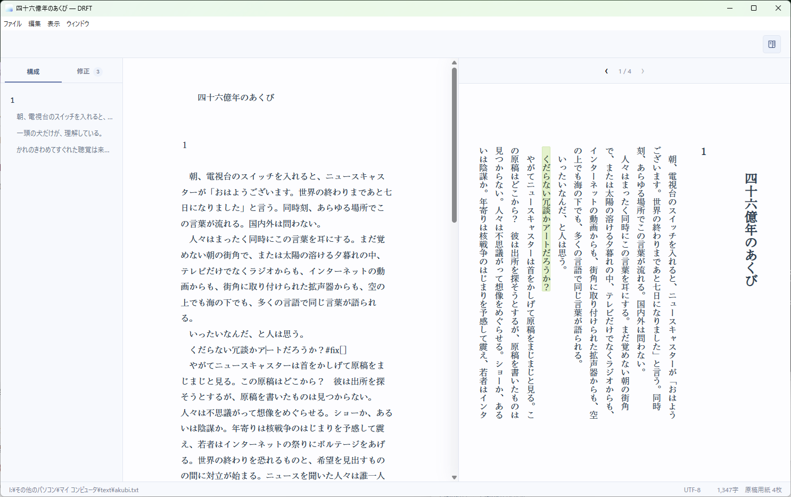

# DRFT

DRFTは、商業出版の原稿作成に必要な機能を搭載したWindows向け軽量小説執筆エディタです。

※動作検証はしていませんがMacOSでも使用可能です

手元では30万字の原稿まで入力遅延なく動作することを確認しています。



## インストールと起動

### Windows配布版を使う

1. [Releases](https://github.com/swonoda/drft/releases/latest)から最新のZIPファイルをダウンロードします。
2. ZIPファイルを解凍します。
3. インストーラー版またはポータブル版の実行ファイルを起動します。

### ソースコードから起動する

Node.js 22.12以降とnpmが必要です。

```bash
git clone https://github.com/swonoda/drft.git
cd drft
npm install
npm run proof:setup
npm start
```

`npm run proof:setup` は赤ゲラPDFの赤い書き込みと変更箇所を検出するOpenCVを、DRFT専用の環境へ準備します。初回のみ実行してください。OCRによる文字認識は行わず、赤字の内容は画面で手入力します。文書画像は外部サービスへ送信しません。以前の `npm run ocr:setup` も同じ準備コマンドとして利用できます。

ソースコードからの起動はmacOSでも可能です。配布パッケージは現在Windows版のみ用意しています。

### Windows配布版をビルドする

```bash
npm run dist:win
```

インストーラー版とポータブル版が `dist` フォルダへ出力されます。

テストを実行する場合は、次のコマンドを使います。

```bash
npm test
```

## 機能概要

- テキストエディタ
- 縦書きプレビュー（余白・フォント・ページあたりの行数・一行あたりの文字数の調整可）
- 行空きから章と節を判別する構成ビューと、節単位のドラッグ＆ドロップ
- 本文中の `#fix[コメント]` を一覧化する修正ビュー
- 作品別の辞書
- 青空文庫記法・カクヨム記法対応
- 文字コードUTF-8／Shift_JISの変換
- 文字数・400字詰め原稿用紙換算の表示
- スナップショット機能
- 2つのテキストファイルの差分を確認する差分ビュー
- 差分ビューから校正原稿を自動作成・PDFへ出力
- 赤ゲラPDFを横に表示し、仮反映した原稿を確認してから本原稿へ反映するレビュー画面（試作）
- 縦書きPDF/EPUBの出力

操作方法と記法の詳細は[ユーザーマニュアル](docs/manual.md)を参照してください。

## License

DRFTは[MIT License](LICENSE)で公開されています。
