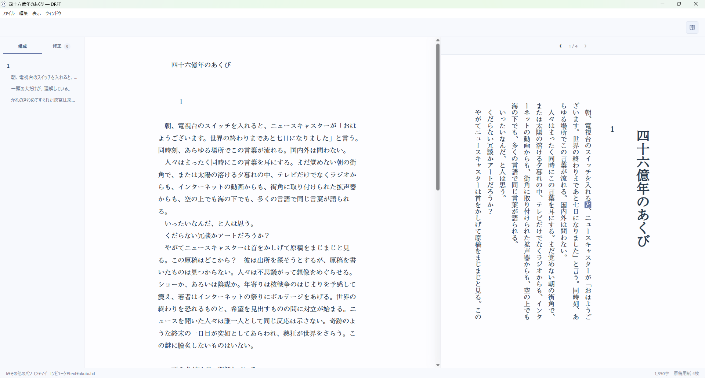

# DRFT

DRFTは、Windows向けの軽量な小説執筆用エディタです。

原稿は横書きのTXTで編集し、必要なときだけ縦書きプレビューで組版を確認できます。独自のプロジェクト形式を使わないため、ほかのエディタやクラウドストレージとの併用も可能です。

手元では30万字の原稿まで入力遅延なく動作することを確認しています。



## インストールと起動

### Windows配布版を使う

1. [Releases](https://github.com/swonoda/drft/releases/latest)から最新のZIPファイルをダウンロードします。
2. ZIPファイルを解凍します。
3. インストーラー版またはポータブル版の実行ファイルを起動します。

### ソースコードから起動する

Node.js 22.12以降とnpmが必要です。

```bash
git clone https://github.com/swonoda/drft.git
cd drft
npm install
npm start
```

ソースコードからの起動はmacOSでも可能です。配布パッケージは現在Windows版のみ用意しています。

### Windows配布版をビルドする

```bash
npm run dist:win
```

インストーラー版とポータブル版が `dist` フォルダへ出力されます。

テストを実行する場合は、次のコマンドを使います。

```bash
npm test
```

## 機能概要

- 一行の文字数・1ページの行数・フォント・字間・行間を調整できる縦書きプレビュー
- 行空きから章と節を判別する構成ビューと、節単位のドラッグ＆ドロップ
- 本文中の `#fix[コメント]` を一覧化する修正ビュー
- 見出しと説明だけで管理できる作品別の辞書
- 青空文庫記法・カクヨム記法のルビと傍点
- UTF-8／Shift_JISの読み書きと、文字数・400字詰め原稿用紙換算の表示
- 作業前の原稿を別ファイルへ残すスナップショット
- 2つのTXTを単語単位で確認する比較画面
- 削除・置換・追加を校正記号で重ねる校正原稿と朱入り原稿PDF
- 右綴じ見開きPDFと縦書きEPUBの出力

操作方法と記法の詳細は[ユーザーマニュアル](doc/manual.md)を参照してください。

## License

DRFTは[MIT License](LICENSE)で公開されています。
